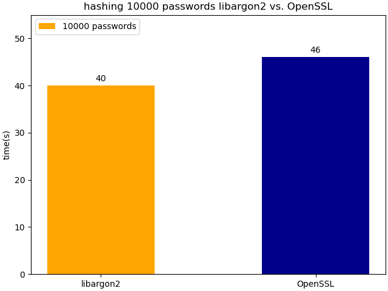
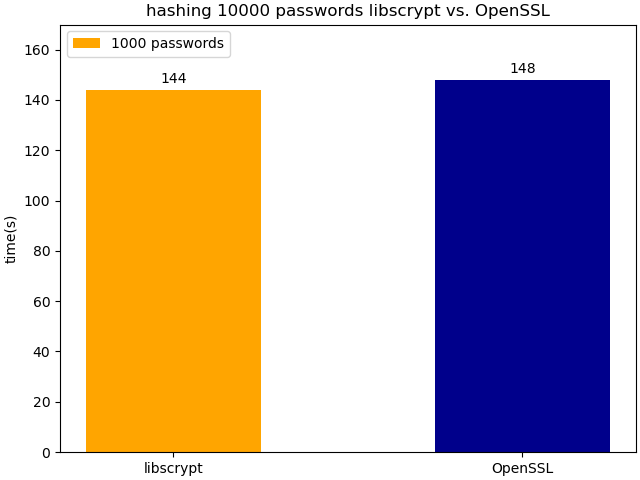

<!-- TOC -->
* [About pg_pwhash](#about-pg_pwhash)
  * [Supported password hashing algorithms](#supported-password-hashing-algorithms)
  * [Requirements](#requirements)
* [Installing](#installing)
  * [Install using meson](#install-using-meson)
  * [Install using make](#install-using-make)
* [Motivation](#motivation)
* [Usage](#usage)
* [The `pwhash_gen_salt()` function](#the-pwhash_gen_salt-function)
* [Argon2 password hashing](#argon2-password-hashing)
  * [argon2id](#argon2id)
  * [argon2i](#argon2i)
  * [argon2d](#argon2d)
  * [argon2id with OpenSSL backend](#argon2id-with-openssl-backend)
  * [Argon2 salt parameters](#argon2-salt-parameters)
    * [Extensions to Argon2 salt parameters.](#extensions-to-argon2-salt-parameters)
    * [Examples using explicit argon2 parameters for hashing](#examples-using-explicit-argon2-parameters-for-hashing)
    * [Choices of backends](#choices-of-backends)
* [Scrypt password hashing](#scrypt-password-hashing)
  * [Scrypt hashes with crypt backend](#scrypt-hashes-with-crypt-backend)
  * [Scrypt hashes with the libscrypt](#scrypt-hashes-with-the-libscrypt)
  * [Scrypt hashes with the OpenSSL backend](#scrypt-hashes-with-the-openssl-backend)
  * [Scrypt salt parameters](#scrypt-salt-parameters)
    * [Parameters supported by the `libscrypt` and `OpenSSL` backend](#parameters-supported-by-the-libscrypt-and-openssl-backend)
    * [Parameters supported by the `crypt` backend](#parameters-supported-by-the-crypt-backend)
    * [Choice of backends](#choice-of-backends)
* [Yescrypt password hashing](#yescrypt-password-hashing)
  * [yescrypt hashing example](#yescrypt-hashing-example)
  * [Yescrypt salt parameters](#yescrypt-salt-parameters)
* [Function Overview](#function-overview)
  * [Function Examples](#function-examples)
    * [`pwhash_scrypt()` usage](#pwhash_scrypt-usage)
    * [`pwhash_yescrypt_crypt()` usage](#pwhash_yescrypt_crypt-usage)
    * [`pwhash_scrypt_crypt()` usage](#pwhash_scrypt_crypt-usage)
    * [`pwhash_argon2()` usage](#pwhash_argon2-usage)
* [Security](#security)
<!-- TOC -->

# About pg_pwhash

The extension `pg_pwhash` provides advanced password hashing methods based on adaptive implementations.

## Supported password hashing algorithms

The following hashing algorithms are supported if all requirements are met:

1. `yescrypt`
2. `Argon2` based on RFC 9106
3. `scrypt`

## Requirements

- Decent Linux platform, tested are Debian 12, Rocky Linux 8/9/10, more testing/reports welcome
- OpenSSL >= 3.2
- libargon2
- libscrypt
- `libxcrypt` support
- Currently PostgreSQL 17 or 18 required

`pg_pwhash` can be configured to compile of one or more of the requirements are not met, though specific
functionality may be missing then (see table below).

The following table illustrates tested and supported combinations of Linux and `pg_pwhash` and supported
libraries/APIs.

|               | libargon2 | OpenSSL(Argon2) | libscrypt | OpenSSL(scrypt) | libcrypt(yescrypt) | libcrypt(scrypt) |
|---------------|-----------|-----------------|-----------|-----------------|--------------------|------------------|
| Debian 12     | X         |                 | X         | X               | X                  | X                |
| Debian 11     | X         |                 | X         | X               | X                  | X                |
| Rocky Linux 8 | X         |                 | X         | X               |                    |                  |
| Rocky Linux 9 | X         | X               | X         | X               | X                  | X                |

Like Python's `passlib`, you can select different backends to use for hashing your password, depending
on the choosen hash algorithm. See below for details.

# Installing

## Install using meson

The easiest way to build and install `pg_pwhash` is to use `meson`. Make sure the `pg_config`
tool of your targeting PostgreSQL installation is available in $PATH and execute the following
in the directory of `pg_pwhash`:

```shell
meson setup build
ninja -C build install
```

You can execute tests on the final build with the following command:

```shell
ninja -C build test
```

## Install using make

In opposite to the `meson` build system, using make doesn't configure the extension automatically.
We don't provide `autotools` configure system (yet), so you need to set the proper macros to enable
all features yourself. The following compiler directives can be set to influence the set of features
provided by `pg_pwhash` via the `PROFILE` macro used by `make`:

- `_PWHASH_ARGON2_OSSL_SUPPORT`: Builds with `Argon2` hash support via `OpenSSL`.
- `_PWHASH_CRYPT_SCRYPT_SUPPORT`: Enables `crypt()` wrapper for `scrypt`.
- `_PWHASH_CRYPT_YESCRYPT_SUPPORT`: Enables `yescrypt` password hashing with the `crypt()` wrapper.

Please note that you need proper library support when enabling those. Otherwise the compilation will
fail. 

To finally build the `pg_pwhash` extension use the following command as an example. This enables all
features via the compiler macros explained above (make sure the `pg_config` tool can be found):

```shell
make PROFILE="-D_PGXCRYPTO_ARGON2_OSSL_SUPPORT=1 -D_PGXCRYPTO_CRYPT_SCRYPT_SUPPORT=1 -D_PGXCRYPTO_CRYPT_YESCRYPT_SUPPORT=1"
```

If you want to built against a specific PostgreSQL version (like on Debian), you can specify the
`pg_config` binary on the command line without exporting it via `PATH`:

```shell
PG_CONFIG=/usr/lib/postgresql/17/bin/pg_config \
  make PROFILE="-D_PGXCRYPTO_ARGON2_OSSL_SUPPORT=1 -D_PGXCRYPTO_CRYPT_SCRYPT_SUPPORT=1 -D_PGXCRYPTO_CRYPT_YESCRYPT_SUPPORT=1"
```

# Motivation

PostgreSQL offers the `pgcrypto` extension to create password hashes with the `crypt()` function. 
Though this implementation just provides `sha256crypt` or `sha512crypt` for modern password hashing only,
and this only with PostgreSQL 18. Other available implementations there are considered outdated and 
unsafe. Since many other modern password hashing methods can be found only with specific library
versions on specific platforms, it is hard to provide support for those modern algorithms without having to 
either maintain these implementations yourself or find a library which runs on any platform PostgreSQL
currently supports.

This is hard to achieve and even recent `OpenSSL` versions are currently limited in supporting more algorithms like
`scrypt` or `argon2`. Since we can't achieve this easily with PostgreSQL, we just provide an extension `pg_pwhash`, which
at least tries to support modern password hashing algorithms via supported libraries on Linux. The
extension can be build with support for `libscrypt`, `libargon2`, `OpenSSL` and direct platform
support for `crypt`. If a platform lacks support for one or multiple of these, `pg_pwhash` can
be configured to be compiled with various combinations.

You can also try to build with the `meson` build system, which tries to configure the `pg_pwhash` 
builds automatically, so that all combinations can be used. Having support for multiple backends like
`libargon2` or `OpenSSL` at the same time was one design goal of this extension. Users can then
decide which kind of backend they want to use to hash the password with a specific algorithm.
Currently `pg_pwhash` requires at least PostgreSQL 17.

# Usage

Using `pg_pwhash` to generate password hashes follows the same pattern than `crypt()`: you generate a
complete randomized salt for the requested hash algorithm and pass this to the `pwhash_crypt()` function.
The `pwhash_crypt()` needs a salt string, that identifies the hashing algorithm to be used to hash
the given password. To ease the usage, users are adviced to use the `pwhash_gen_salt()` function, which
takes the algorithm name to use to generate a fully randomized salt string. The following examples
demonstrates this for each of the supported hash algorithms.

# The `pwhash_gen_salt()` function

`pwhash_gen_salt()` creates a salt string for the requested hash algorithm with default settings and
a complete randomized salt. The salt string itself is `base64` encoded.

The first argument is a string that identifies the hash algorithm the salt string should be generated for.
The following arguments are strings composed of key/value pairs. The supported key/value pairs are
dependant on the selected hash algorithms (see documentation below). The following table shows
the identifiers supported by `pwhash_gen_salt()` and default settings used in the generated salt string:

| Identifier | Algorithm                | Generated Salt for Hash Algorithm                |
|------------|--------------------------|--------------------------------------------------|
| `argon2i`  | Argon2i                  | `$argon2i$v=19$m=4096,t=3,p=1$<salt>`            |
| `argon2d`  | Argon2d                  | `$argon2d$v=19$m=4096,t=3,p=1$<salt>`            |
| `argon2id` | Argon2id                 | `$argon2id$v=19$m=4096,t=3,p=1$<salt>`           |
| `scrypt`   | Scrypt                   | `$scrypt$ln=16,r=8,p=1,backend=libscrypt$<salt>` |
| `$7$`      | Scrypt (crypt backend)   | `$7$BU<salt>`                                    |
| `yescrypt` | yescrypt (crypt backend) | `$y$j9T$<salt>`                                  |


# Argon2 password hashing

`Argon2` is an advanced, adaptive password hashing algorithm which is considered to be very safe against attacks. `pg_pwhash` provides
 two implementations, one which uses `OpenSSL`, the other the `libargon2` library. Per default,
the following functions use the `libargon2` library backend to hash passwords. This can be easily
controlled by the `pg_pwhash.argon2_default_backend` PostgreSQL configuration setting (see examples below).

## argon2id

```postgresql
SELECT pwhash_crypt('password', pwhash_gen_salt('argon2id'));
pwhash_crypt                                           
--------------------------------------------------------------------------------------------------
 $argon2id$v=19$m=4096,t=3,p=1$gMvZQnYRYVvgH4ippDMGpA$Hy4liWHde8JTQgP0ZmUzt5ZEjP0yIi97jynWG44ZANU
(1 row)
```

## argon2i

```postgresql
SELECT pwhash_crypt('password', pwhash_gen_salt('argon2i'));
                                          pwhash_crypt                                           
-------------------------------------------------------------------------------------------------
 $argon2i$v=19$m=4096,t=3,p=1$hXDYmfYQXztS1fbWLBouvw$ngnE1/i9NDUuE9rEcddL+suYFvGsCq3t7ey0iAngZxs
(1 row)
```

## argon2d

```postgresql
SELECT pwhash_crypt('password', pwhash_gen_salt('argon2d'));
                                          pwhash_crypt                                           
-------------------------------------------------------------------------------------------------
 $argon2d$v=19$m=4096,t=3,p=1$ywoU7/F2nGKQvBrtlw0YqQ$vo1JdMO1+k1woV0Dt0T7A0cg/NtDtO2O0u7HAcmN6+Q
(1 row)
```

## argon2id with OpenSSL backend

```postgresql
SET pg_pwhash.argon2_default_backend TO 'openssl';

SELECT pwhash_crypt('password', pwhash_gen_salt('argon2id'));
pwhash_crypt                                           
--------------------------------------------------------------------------------------------------
 $argon2id$v=19$m=4096,t=3,p=1$GJslOioaQ3Eh1IFlJ64GjQ$H6wC2tXVpi3lbemeFZHcohcF/hQit9WHd0DtC9WgZZI
(1 row)
```

This works identically with `argon2i` and `argon2d` of course.

## Argon2 salt parameters

Argon2 is an adaptive password hashing algorithm which allows applications to configure its behavior
(and hash strength) in multiple ways. `pg_pwhash` supports the standard short identifiers but also
a more descriptive long format. Please note that long parameter names aren't used in generated
salt string, they are always translated to their short forms for compatibility reasons. 

- `threads`, `p`: This configures the number of threads OpenSSL uses to hash the input. The default
  is `1`.
- `lanes`, `l`: This configures the memory blocks which are processed in parallel. `lanes` can be
  larger or  equal to the number of configured `threads`, but not less. The default is using `1` lanes. Be
  aware that changing this parameters influences the generated digest of the password.
- `memcost`, `m`: This is the number of memory the hashing algorithm is allowed to use. This
  parameter value reflects the number of `1kB` memory blocks. The default is `4096`, which equals to
  4096 kB of memory. Be aware that changing this parameters influences the generated digest of
  the password.
- `rounds`, `t`: This parameter configures the number of computation rounds used to generate the
  digest. The default is `3`. Be aware that changing this parameters influences the generated digest of the password.
- `size`: This is the tag length of the digest to generate. The default of `32` results in 256
  Bit for the digest length (32 Bytes, not base64 encoded).

### Extensions to Argon2 salt parameters.

In the `pg_pwhash` extension, there are some extensions to the list of parameters, but they are never used in generated salt strings.

- `output_format`: This parameter is supported by `pgxcrypto` only and allows to switch between
  `base64` encoded keys (the default) or `hex` encoded hash keys. Don't use this if you intend to
  share the keys between systems. This affects the output of the password hash only. Mostly there
  for testing purposes and might be removed some time.
- `backend`: Choose between `openssl` and `libargon2` backend to create the password
  digest. Note: `openssl` requires at least OpenSSL >= 3.2 to work. `libargon2` is the default.

### Examples using explicit argon2 parameters for hashing

Increase computing time to generate a more hardened hash (`rounds` parameter):

```postgresql
SELECT pwhash_crypt('password', pwhash_gen_salt('argon2id', 'rounds=8192'));
                                            pwhash_crypt                                             
-----------------------------------------------------------------------------------------------------
 $argon2id$v=19$m=4096,t=8192,p=1$Ld2lVsdRwq5X5ug1z3FXog$vcpZMm2svpwwzW3D+OlM2mIMhtI4J51xjHnyysK6YKw
(1 row)

Time: 12177,762 ms (00:12,178)
```

Accelerate the example above by using four computing threads (`threads` parameter):

```postgresql
SELECT pwhash_crypt('password', pwhash_gen_salt('argon2id', 'rounds=8192', 'threads=4'));
                                            pwhash_crypt                                             
-----------------------------------------------------------------------------------------------------
 $argon2id$v=19$m=4096,t=8192,p=4$OHqrd19JeeHDhtxuwNDILA$83U1VoGYWVEgpdpTuauaGtASz7CnqSbLBYswrBhRs3s
(1 row)

Time: 6963,473 ms (00:06,963)
```

The practical reasonable setting depends on your needs and resources you want to put into hardening
your password hashes. Chapter 4 of [RFC9106](https://www.rfc-editor.org/rfc/rfc9106.html#name-argon2-algori) is
a recommended read if you are unsure whether you need to adjust the defaults. Please note that `pg_pwhash`
currently follows for most of the default settings Python's 
[passlib](https://passlib.readthedocs.io/en/stable/lib/passlib.hash.argon2.html#format-algorithm).

### Choices of backends

`Argon2` hashes can be derived by using either the `libargon2` or `OpenSSL` backends. 
Though on a machine with AMD Ryzen 9 5950X CPU `libargon2` seems to have a slight  performance advantage
when hashing a list of random generated MD5 strings with default settings.

The following graph shows the difference:



# Scrypt password hashing

`scrypt` password hashes are supported by currently three backends: `crypt`, `OpenSSL` and `libscrypt`.
Though `crypt` generated password hashes are incompatible with hashes generated by `OpenSSL` and `libscrypt`.
That's why they used different hash identifiers; their magic strings at the beginning of the generated hash string
differs to make it possible to distinguish them. Scrypt hashes generated by `libscrypt` or `OpenSSL`
are compatible when using identical salt strings.

`crypt`-based hashes generated by scrypt are using the `$7$` identifier, whereas hashes via `OpenSSL` 
or `libscrypt` both use the `$scrypt$` magic string.

Currently, unlike with `Argon2` password hashing, there is no GUC that controls
choosing the default backend for `scrypt` password hashing. The problem with the different definitions 
between `crypt` and both, `libscrypt` and `OpenSSL` make it hard to guess what behavior is the right one.
Since switching just from `libscrypt` and `OpenSSL` to `crypt` causes `pwhash_crypt()` to behave
differently is probably not the right choice. Thus no GUC to control default
backends for `scrypt` is implemented. Instead users should provide the `backend` parameter when generating
salts. How to use this can be found below in the usage examples.

## Scrypt hashes with crypt backend

To generate password hashes with `scrypt` and the `crypt` backend use the following example:

```postgresql
SELECT pwhash_crypt('password', pwhash_gen_salt('$7$'));
                                   pwhash_crypt                                   
----------------------------------------------------------------------------------
 $7$BU..../....l1NV9enHbFO9hWGWPbXwq0$S5V.wPGt.MvjFbz.hfEzJqbJDt4ttL7fzgMn2OFADi/
(1 row)
```

## Scrypt hashes with the libscrypt

Per default, Scrypt hashes by using the `libscrypt` backend.

```postgresql
bernd=# SELECT pwhash_crypt('password', pwhash_gen_salt('scrypt'));
                                       pwhash_crypt                                       
------------------------------------------------------------------------------------------
 $scrypt$ln=16,r=8,p=1$bogwfJmj5M/tnETjYmAUdQ$ZQWxlWxAXj/31V8GJ4iveJaTuEsKuw9ZyXDdHzutok0
(1 row)
```

## Scrypt hashes with the OpenSSL backend

OpenSSL also provides scrypt password hashing. Per default, the `libscrypt` backend is used. The
`backend` parameter when generating salts can be specified to switch to `OpenSSL`:

```postgresql
SELECT pwhash_crypt('password', pwhash_gen_salt('scrypt', 'backend=openssl'));
                                       pwhash_crypt                                       
------------------------------------------------------------------------------------------
 $scrypt$ln=16,r=8,p=1$vy+y/t3ZH6x1mE+viPaiLg$o1D2VXaZQHBrmss5J5AufpJHih2uOpb2QdLs/ahBJ9I
(1 row)
```

## Scrypt salt parameters

### Parameters supported by the `libscrypt` and `OpenSSL` backend

Like with `Argon2`, the `pg_pwhash` extension supports parameters to configure the behavior
of `scrypt` hashing. The following list gives an overview about these parameters:

When generating hashes based on `scrypt`, the following parameters can be used to configure and influence
the strength and security of the resulting hash:

- `block_size/r`: This specifies the `block size` used for hashing. The default is `8`. The allowed
  range currently is from `1` to `1024`, but the upper limit might change once we know where a practical value exactly exists.
  Adjusting this value might be interesting to get optimal performance on your specific CPU.
- `rounds/ln`: This adjusts the cost parameter used when calculating the hashes. Raising this value
  not only increases CPU time but also memory consumption. So it should be used with careful testing.
  _NOTE_: The default used here is `16`, allowed range is from `1` to `32`. Though testing shows that `OpenSSL`
  allows values up to `21` only, going above this limit yields the following error where `libscrypt` succeeds:

```postgresql
SELECT pwhash_crypt('password', pwhash_gen_salt('scrypt', 'backend=openssl', 'rounds=22'));
ERROR:  cannot derive test vector

SELECT pwhash_crypt('password', pwhash_gen_salt('scrypt', 'backend=libscrypt', 'rounds=22'));
pwhash_crypt                                       
──────────────────────────────────────────────────────────────────────────────────────────
 $scrypt$ln=22,r=8,p=1$H72V4Yu4oNcJ+j8bipbNcg$nfNxmJx9mH+d431ChtWDEZ5AG3pBwj9yESGE+YKJGYs
(1 row)

Time: 9402,637 ms (00:09,403)
```

- `parallelism/p`: The number of parallel calculations. Default is `1`. The allowed values are `1` to
  `1024`.
- `backend`: This is an extension to the list of supported parameters propietary to `pgxcrypto_pwhash()`. This allows to
  switch from the default backend `libscrypt` to `openssl`.

The generated hashes should be compatible with python's `passlib` and OpenSSL.

````
Note:

The backend parameter is currently not reflected in the final password hash.
````

### Parameters supported by the `crypt` backend

The following parameters can be used by the `crypt` backend:

- `rounds`: Configures the amount of computing time spent to generate `scrypt` hashes. This also influences
memory _and_ CPU, so use it with care especially on systems with less resources. A setting of `6` is 
the default currently. The `rounds` parameter accepts values between `6` and `11` in this context.

### Choice of backends

Users that want to hash input via `scrypt` have the choice between `crypt`, `libscrypt` and `OpenSSL`
backends. Since `crypt` hashes for `scrypt` aren't compatible, the choice here is easy: If you want
to create hashes comparable with your platform using `libcrypt` (or `libxcrypt` respectively), you need to
use `crypt` backend. For hashes generated via `libscrypt` or `OpenSSL` there seems to be a very slight
performance advantage by using `libscrypt`, as the following figure shows. This was measured on a
AMD Ryzen 9 5950X CPU with default hashing parameter settings.



# Yescrypt password hashing

`pg_pwhash` provides password hashing with the `yescrypt` algorithm via a wrapper built around libc's
`crypt` API. Currently only recent version of Linux distributions provide them, see the table above
for tested platforms.

`yescrypt` is currently implemented on top of `crypt()`. There is a standalone implementation available, but
not as a shared library or API or such. We might adapt the implementation by Openwall, but its unclear what
licensing they provide:

https://www.openwall.com/yescrypt/

## yescrypt hashing example

```postgresql
SELECT pwhash_crypt('password', pwhash_gen_salt('yescrypt'));
                               pwhash_crypt                                
---------------------------------------------------------------------------
 $y$j9T$yX6j67Wg8K9v4fpzVatdu1$1gzlyzFzneVKdlmSYwBsrbTOv2phq2OVxQ0YgJnJ/k5
(1 row)
```

## Yescrypt salt parameters

- `rounds`: `yescrypt` hashes can be configured with `rounds` value between `1` and `11`. The default
value is `5`. `rounds` adjusts computing time and can be 

# Function Overview

| Function Name             | Description                                                           |
|---------------------------|-----------------------------------------------------------------------|
| `pwhash_crypt()`          | Main hash function, wrapper for all supported algorithms              |
| `pwhash_gen_salt()`       | Generates a salt string for the specified hash algorithm              |
| `pwhash_argon2()`         | Calls `argon2` hashing directly                                       |
| `pwhash_scrypt()`         | Calls `scrypt` hashing directly (either OpenSSL or libscrypt backend) |
| `pwhash_scrypt_crypt()`   | Calls `scrypt` hashing wrapper with `crypt()` directly                |
| `pwhash_yescrypt_crypt()` | Calls `yescrypt` hashing wrapper with `crypt()` directly              |

Usage of `pwhash_crypt()` in combination with `pwhash_gen_salt()` to select the hash algorithm is
recommended. Calling the functions `pwhash_argon2()`, `pwhash_scrypt()`, `pwhash_scrypt_crypt()` and
`pwhash_yescrypt_crypt()` functions with non-matching salt strings causes an error. Use `pwhash_gen_salt()`
with the proper magic identifier to get a suitable salt string in this case, like shown in the examples
below.

## Function Examples

### `pwhash_scrypt()` usage

Create a hashed password with `scrypt` and parameters `rounds=10`, `parallelism=2`

```postgresql
SELECT pwhash_scrypt('password', pwhash_gen_salt('scrypt', 'rounds=10', 'parallelism=2'));
                                      pwhash_scrypt                                       
──────────────────────────────────────────────────────────────────────────────────────────
 $scrypt$ln=10,r=8,p=2$WTqOEtKK+FbVBMg3oqqpWg$LqhWcrhiBxfHGlqNMvt/fXLfWGHVbhQxHXmR6Sb1btI
(1 row)
```

### `pwhash_yescrypt_crypt()` usage

Create a password hash with `yescrypt` and current `crypt()` wrapper. Additionally raise
computing time with the `rounds` parameter to its maximum value of `11`:

```postgresql
SELECT pwhash_yescrypt_crypt('password', pwhash_gen_salt('yescrypt', 'rounds=11'));
                           pwhash_yescrypt_crypt                           
───────────────────────────────────────────────────────────────────────────
 $y$jFT$RzVvFG1YoR/YZj3QdGImu/$CWO5JAJmlQaqk8.4kbOtTSzs3o8MTZXPkO11J6QkqU1
(1 row)
```

### `pwhash_scrypt_crypt()` usage

This function is a wrapper for `crypt()` and hashing passwords with `scrypt`. Note that this requires
the special magic identifier string `$7$`, `scrypt` doesn't work here because this identifier is
reserved for `OpenSSL`/`libargon2` backends and creates incompatible hashes.

```postgresql
SELECT pwhash_scrypt_crypt('password', pwhash_gen_salt('$7$', 'rounds=11'));
                               pwhash_scrypt_crypt                                
──────────────────────────────────────────────────────────────────────────────────
 $7$GU..../....SfMYfrYmgGGZbmDpiX6o..$skYly2jjdQ1xBIz4bqhsMHYQcNqiomhZ1mXwnbKdnaA
(1 row)
```

### `pwhash_argon2()` usage

The function `pwhash_argon2()` calls the `argon2` hashing backends `OpenSSL`/`libargon2` directly.

The following example creates a password hash with `argon2d` algorithm and increases compute time with
the `rounds=12` parameter. Additionally we are explicitely switching to `OpenSSL` backend via the
`backend` parameter:

```postgresql
SELECT pwhash_argon2('password', pwhash_gen_salt('argon2d', 'rounds=12', 'backend=openssl'));
                                                  pwhash_argon2                                                   
──────────────────────────────────────────────────────────────────────────────────────────────────────────────────
 $argon2d$v=19$m=4096,t=12,p=1,backend=openssl$AiCwwSsJrgcF0cYVjI8J7g$D4sRQc8bDOe8eYkseJAp+/6f1pUgWLbGw4Irs6EmKbA
(1 row
```

# Security

Passing passwords over to a database, especially if remote requires some security considerations.
Clients should always only use SSL-encrypted connections to PostgreSQL, transferring sensitive data over unencrypted
channels could leak these sensitive information. This is true for probably any data that is transferred
and may contain personal and other information.

It is also important to consider database logs, since logged SQL statements can contain this information and
ship to other channels which aren't treated in the same security context than the database itself.
